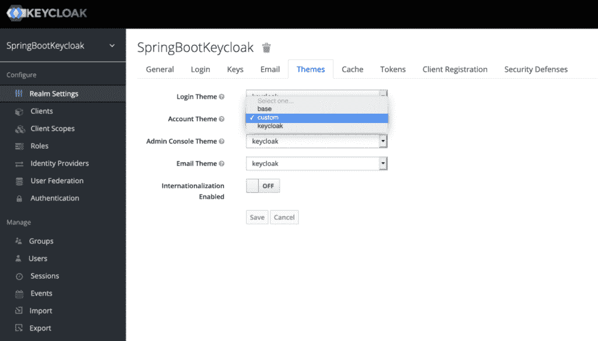
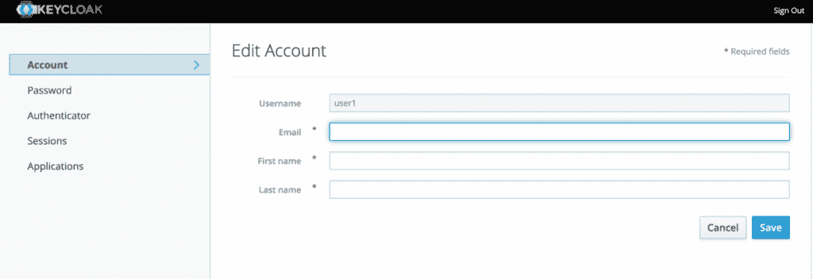
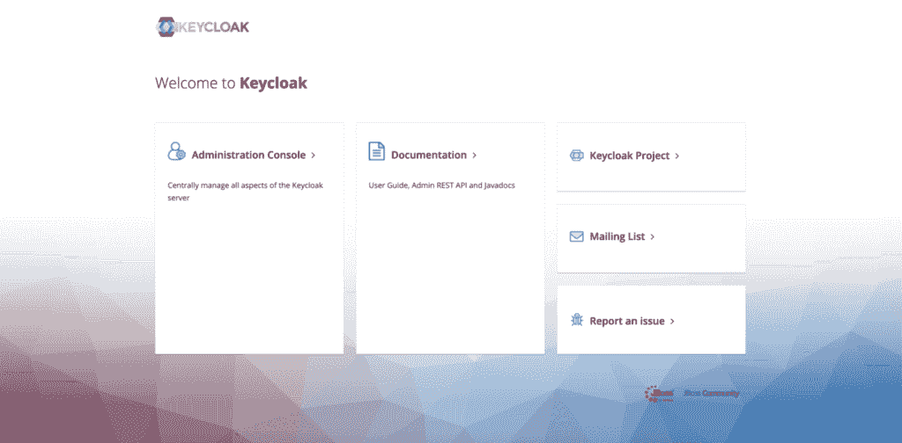
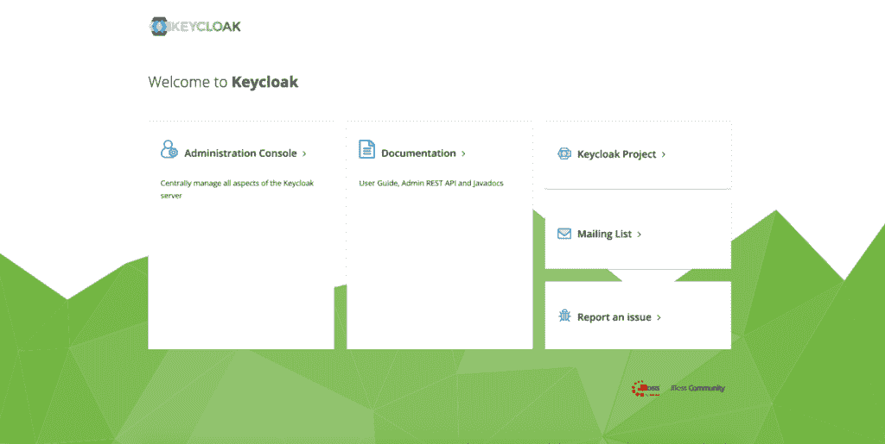

# 自定义键盘锁的主题

> 原文：<https://web.archive.org/web/20220930061024/https://www.baeldung.com/spring-keycloak-custom-themes>

## 1.概观

[Keycloak](https://web.archive.org/web/20221026143345/https://www.keycloak.org/) 是一个开源的身份和访问管理(IAM)解决方案，可以用作第三方授权服务器来管理我们的 web 或移动应用程序的身份验证和授权需求。

在本教程中，我们将重点讨论如何为我们的 Keycloak 服务器定制主题，这样我们就可以为面向最终用户的网页提供不同的外观和感觉。

首先，我们将从独立的 Keycloak 服务器的角度建立一个背景。在后面的章节中，我们将在嵌入式环境中查看类似的例子。

为此，**我们将在之前文章的基础上再接再厉:[使用 Keycloak](/web/20221026143345/https://www.baeldung.com/spring-boot-keycloak) 和 [Keycloak 嵌入 Spring Boot 应用](/web/20221026143345/https://www.baeldung.com/keycloak-embedded-in-spring-boot-app)的快速指南。所以，对于那些刚开始的人来说，先浏览一遍是个好主意。**

## 2.钥匙槽中的主题

### 2.1.默认主题

Keycloak 中预先构建了一些主题，并与发行版捆绑在一起。

对于独立服务器，可以在`keycloak-<version>/themes`目录中找到不同的文件夹:

*   `base`:包含 HTML 模板和消息包的骨架主题；包括自定义主题在内的所有主题通常都继承自它
*   `keycloak`:包含美化页面的图片和样式表；如果我们不提供自定义主题，这就是默认使用的主题

不建议修改现有主题。相反，我们应该创建一个扩展上述两个主题之一的新主题。

**要创建一个新的定制主题，我们需要在`themes`目录**中添加一个新文件夹，我们称之为`custom`。如果我们想要彻底检查，从`base`文件夹中复制内容是最好的启动方式。

对于我们的演示，我们不打算替换所有内容，所以从`keycloak`目录中获取内容是实用的。

正如我们将在下一节中看到的，`custom`将只需要我们想要覆盖的主题类型的内容，而不是整个`keycloak` 文件夹。

### 2.2.主题的类型

Keycloak 支持六种类型的主题:

1.  常用:用于字体等常用项目；由其他主题类型导入
2.  欢迎:登录页面
3.  登录:用于登录、OTP、授权、注册和忘记密码页面
4.  帐户:用于用户帐户管理页面
5.  管理控制台:对于管理控制台
6.  电子邮件:对于由服务器发送的电子邮件

上面列表中的最后四个主题可以通过独立服务器的管理控制台进行设置。当我们在`themes`目录中创建新文件夹时，在服务器重启后可以选择它。

让我们使用凭证`initial1` / `zaq1!QAZ` 登录管理控制台，并转到我们领域的`Themes`选项卡:

[](/web/20221026143345/https://www.baeldung.com/wp-content/uploads/2020/08/AdminConsleSpringBootKeycloak-1536x877-1.png)

值得注意的是，主题是按领域设置的，所以我们可以为不同的领域设置不同的主题。这里**我们正在为我们的 [`SpringBootKeycloak`](/web/20221026143345/https://www.baeldung.com/spring-boot-keycloak#create-realm) 领域**设置用户账户管理的`custom`主题。

### 2.3.主题类型的结构

除了 HTML 模板、消息包、图片和我们在`Default Themes`小节中概述的样式表之外，Keycloak 中的主题还包括一些元素——主题属性和脚本。

每个主题类型包含一个`theme.properties`文件。作为一个例子，让我们看看这个来自`account`类型的文件:

```
parent=base
import=common/keycloak

styles=css/account.css
stylesCommon=node_modules/patternfly/dist/css/patternfly.min.css node_modules/patternfly/dist/css/patternfly-additions.min.css
```

正如我们所看到的，这个主题从`base`主题扩展到所有的 HTML 和消息包，并且还导入了`common`主题，从中包含了一些`styles`。除此之外，它还定义了自己的风格，`css/account.css`。

脚本是一个可选功能。如果我们需要为给定主题类型的模板包含定制的 JavaScript 文件，我们可以创建一个`resources/js`目录并保存在那里。接下来，我们需要将它们包含在我们的`theme.properties`中:

```
scripts=js/script1.js js/script2.js
```

### 2.4.添加自定义

现在到了有趣的部分！

让我们以账户管理页面为例，看看如何改变它的外观。准确地说，**我们将改变出现在页面**上的标志。

就在我们要做所有的修改之前，下面是原始模板，可在 [`http://localhost:8180/auth/realms/SpringBootKeycloak/account`](https://web.archive.org/web/20221026143345/http://localhost:8180/auth/realms/SpringBootKeycloak/account) 获得:

[](/web/20221026143345/https://www.baeldung.com/wp-content/uploads/2020/08/AccountUser1Before-1536x528-1.png)

让我们试着把标志改成我们自己的。为此，我们需要在`themes/custom`目录中添加一个新文件夹`account`。我们宁愿从`themes/keycloak`目录中复制它，这样我们就有了所有需要的元素。

现在，只需要添加我们的新徽标文件，比如在我们的`custom`目录中添加`baeldung.png`到`resources/img`并修改`resources/css/account.css`:

```
.navbar-title {
    background-image: url('../img/baeldung.png');
    height: 25px;
    background-repeat: no-repeat;
    width: 123px;
    margin: 3px 10px 5px;
    text-indent: -99999px;
}

.container {
    height: 100%;
    background-color: #fff;
} 
```

这是页面现在的样子:

[](/web/20221026143345/https://www.baeldung.com/wp-content/uploads/2020/08/AccountUser1After-1536x524-1.png)

**重要的是，在开发阶段，我们希望立即看到我们的更改的效果，而无需重启服务器**。为此，我们需要对 Keycloak 在`standalone/configuration`文件夹中的`standalone.xml` 做一些修改:

```
<theme>
    <staticMaxAge>-1</staticMaxAge>
    <cacheThemes>false</cacheThemes>
    <cacheTemplates>false</cacheTemplates>
    ...
</theme> 
```

类似于我们在这里定制`account`主题的方式，为了改变其他主题类型的外观和感觉，我们需要添加名为`admin`、`email,`或`login`的新文件夹，并遵循相同的过程。

### 2.5.自定义欢迎页面

要定制欢迎页面，首先，我们需要在`standalone.xml`中添加一行:

```
<theme>
    ...
    <welcomeTheme>custom</welcomeTheme>
    ... 
</theme> 
```

其次，我们必须在`themes/custom`下创建一个文件夹`welcome`。同样，谨慎的做法是从默认的`keycloak`主题目录中复制`index.ftl`和`theme.properties`以及现有的`resources`。

现在让我们试着改变这个页面的背景。

让我们导航到 [`http://localhost:8180/auth/`](https://web.archive.org/web/20221026143345/http://localhost:8180/auth/) 来看看它最初的样子:

[](/web/20221026143345/https://www.baeldung.com/wp-content/uploads/2020/08/WelcomeBefore-1536x756-1.png)

要改变背景图像，保留新图像，在`themes/custom/welcome/resources`中说`geo.png,`，然后简单地编辑`resources/css/welcome.css`:

```
body {
    background: #fff url(../geo.png);
    background-size: cover;
}
```

下面是效果:
[](/web/20221026143345/https://www.baeldung.com/wp-content/uploads/2020/08/WelcomeAfter-1536x773-1.png)

## 3.定制嵌入式 Keycloak 服务器

根据定义，一个[嵌入式 Keycloak 服务器](/web/20221026143345/https://www.baeldung.com/keycloak-embedded-in-spring-boot-app)意味着我们的机器上没有安装 IAM 提供程序。因此，**我们需要在我们的源代码**中保留所有需要的工件，比如`themes.properties`和 CSS 文件。

将它们保存在我们 Spring Boot 项目的`src/main/resources/themes`文件夹中的好地方。

当然，由于主题结构的文件是相同的，我们定制它们的方式也与独立服务器相同。

然而，我们需要配置一些东西来指示 Keycloak 服务器从我们的自定义主题中提取内容。

### 3.1.对领域定义文件的更改

首先，让我们看看如何为给定的主题类型指定自定义主题。

回想一下，在我们的独立服务器的情况下，在我们的管理控制台的`Themes`页面上，我们从`Account Theme`的下拉列表中添加了`custom`主题。

为了达到同样的效果，我们需要在我们的领域定义文件中添加一行代码，`baeldung-realm.json`:

```
"accountTheme": "custom",
```

这就是我们所需要的。所有其他类型如`Login`和`Email`仍将遵循标准主题。

### 3.2.重定向到自定义主题目录

接下来，让我们看看如何告诉服务器所说的`custom`主题的位置。

我们可以用几种方法做到这一点。

在为我们的嵌入式服务器启动引导应用程序时，我们可以将主题目录指定为一个 VM 参数:

```
mvn spring-boot:run -Dkeycloak.theme.dir=/src/main/resources/themes
```

为了以编程方式实现这一点，我们可以在我们的`@SpringBootApplication`类中将它设置为一个系统属性:

```
public static void main(String[] args) throws Exception {
    System.setProperty("keycloak.theme.dir","src/main/resources/themes");
    SpringApplication.run(JWTAuthorizationServerApp.class, args);
}
```

或者，我们可以在`keycloak-server.json`中更改服务器配置:

```
"theme": {
    ....
    "welcomeTheme": "custom",
    "folder": {
        "dir": "src/main/resources/themes"
    }
},
```

值得注意的是，这里我们还添加了一个`welcomeTheme`属性来支持对欢迎页面的定制。

如前所述，**对 CSS 文件和图像的所有其他更改保持不变**。

要查看我们欢迎页面的更改，我们需要启动嵌入式服务器并导航到 [`http://localhost:8083/auth`](https://web.archive.org/web/20221026143345/http://localhost:8083/auth/) 。

账户管理页面位于 [`http://localhost:8083/auth/realms/baeldung/account`](https://web.archive.org/web/20221026143345/http://localhost:8083/auth/realms/baeldung/account) ，我们可以使用以下凭证进入:`[[email protected]](/web/20221026143345/https://www.baeldung.com/cdn-cgi/l/email-protection)` / `123.`

## 4.结论

在本教程中，**我们学习了 Keycloak 中的主题——它们的类型和结构**。

然后，我们看了几个预构建的主题，以及如何在独立实例中扩展它们来创建我们自己的定制主题。

最后，我们看到了如何在嵌入式 Keycloak 服务器中实现同样的功能。

和往常一样，源代码可以在 GitHub 上获得。对于独立服务器，它在[教程 GitHub](https://web.archive.org/web/20221026143345/https://github.com/eugenp/tutorials/tree/master/spring-boot-modules/spring-boot-keycloak) 上，对于嵌入式实例，它在 [OAuth GitHub](https://web.archive.org/web/20221026143345/https://github.com/Baeldung/spring-security-oauth/tree/master/oauth-jwt) 上。