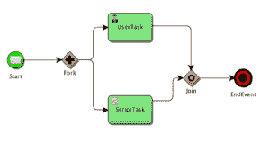

# Spring 状态机项目指南

> 原文：<https://web.archive.org/web/20220930061024/https://www.baeldung.com/spring-state-machine>

## 1。简介

本文主要关注 Spring 的[状态机项目](https://web.archive.org/web/20220930225301/https://spring.io/projects/spring-statemachine)——它可以用来表示工作流或任何其他类型的有限状态自动机表示问题。

## 2。Maven 依赖关系

首先，我们需要添加主要的 Maven 依赖项:

```
<dependency>
    <groupId>org.springframework.statemachine</groupId>
    <artifactId>spring-statemachine-core</artifactId>
    <version>3.2.0.RELEASE</version>
</dependency>
```

这个依赖关系的最新版本可以在[这里](https://web.archive.org/web/20220930225301/https://search.maven.org/classic/#search%7Cgav%7C1%7Cg%3A%22org.springframework.statemachine%22%20AND%20a%3A%22spring-statemachine-core%22)找到。

## 3。状态机配置

现在，让我们从定义一个简单的状态机开始:

```
@Configuration
@EnableStateMachine
public class SimpleStateMachineConfiguration 
  extends StateMachineConfigurerAdapter<String, String> {

    @Override
    public void configure(StateMachineStateConfigurer<String, String> states) 
      throws Exception {

        states
          .withStates()
          .initial("SI")
          .end("SF")
          .states(
            new HashSet<String>(Arrays.asList("S1", "S2", "S3")));

    }

    @Override
    public void configure(
      StateMachineTransitionConfigurer<String, String> transitions) 
      throws Exception {

        transitions.withExternal()
          .source("SI").target("S1").event("E1").and()
          .withExternal()
          .source("S1").target("S2").event("E2").and()
          .withExternal()
          .source("S2").target("SF").event("end");
    }
}
```

注意，这个类被注释为传统的 Spring 配置和状态机。它还需要扩展`StateMachineConfigurerAdapter`，以便可以调用各种初始化方法。在一种配置方法中，我们定义状态机的所有可能状态，在另一种方法中，定义事件如何改变当前状态。

上面的配置展示了一个非常简单的直线转换状态机，应该很容易理解。

[](/web/20220930225301/https://www.baeldung.com/wp-content/uploads/2017/04/simple.png)

现在，我们需要启动一个 Spring 上下文，并获取对我们的配置所定义的状态机的引用:

```
@Autowired
private StateMachine<String, String> stateMachine;
```

一旦我们有了状态机，就需要启动它:

```
stateMachine.start();
```

现在我们的机器处于初始状态，我们可以发送事件，从而触发转换:

```
stateMachine.sendEvent("E1");
```

我们总是可以检查状态机的当前状态:

```
stateMachine.getState();
```

## 4。动作

让我们添加一些围绕状态转换执行的操作。首先，我们在同一个配置文件中将我们的操作定义为一个 Spring bean:

```
@Bean
public Action<String, String> initAction() {
    return ctx -> System.out.println(ctx.getTarget().getId());
}
```

然后，我们可以在配置类中注册上面创建的转换操作:

```
@Override
public void configure(
  StateMachineTransitionConfigurer<String, String> transitions)
  throws Exception {

    transitions.withExternal()
      transitions.withExternal()
      .source("SI").target("S1")
      .event("E1").action(initAction())
```

当通过事件`E1`从`SI`转换到`S1`时，将执行该动作。行动可以附属于国家本身:

```
@Bean
public Action<String, String> executeAction() {
    return ctx -> System.out.println("Do" + ctx.getTarget().getId());
}

states
  .withStates()
  .state("S3", executeAction(), errorAction());
```

该状态定义函数接受当机器处于目标状态时要执行的操作，并且可选地接受错误动作处理程序。

错误操作处理程序与任何其他操作没有太大的不同，但是如果在评估状态操作期间任何时候抛出异常，就会调用它:

```
@Bean
public Action<String, String> errorAction() {
    return ctx -> System.out.println(
      "Error " + ctx.getSource().getId() + ctx.getException());
}
```

也可以注册`entry`、`do`和`exit`状态转换的单个动作:

```
@Bean
public Action<String, String> entryAction() {
    return ctx -> System.out.println(
      "Entry " + ctx.getTarget().getId());
}

@Bean
public Action<String, String> executeAction() {
    return ctx -> 
      System.out.println("Do " + ctx.getTarget().getId());
}

@Bean
public Action<String, String> exitAction() {
    return ctx -> System.out.println(
      "Exit " + ctx.getSource().getId() + " -> " + ctx.getTarget().getId());
}
```

```
states
  .withStates()
  .stateEntry("S3", entryAction())
  .state("S3", executeAction())
  .stateExit("S3", exitAction());
```

相应的动作将在相应的状态转换时执行。例如，我们可能希望在进入时验证一些先决条件，或者在退出时触发一些报告。

## 5。全局监听器

可以为状态机定义全局事件侦听器。这些侦听器将在任何状态转换发生时被调用，并可用于诸如日志记录或安全性之类的事情。

首先，我们需要添加另一种配置方法——这种方法不处理状态或转换，而是处理状态机本身的配置。

我们需要通过扩展`StateMachineListenerAdapter`来定义一个监听器:

```
public class StateMachineListener extends StateMachineListenerAdapter {

    @Override
    public void stateChanged(State from, State to) {
        System.out.printf("Transitioned from %s to %s%n", from == null ? 
          "none" : from.getId(), to.getId());
    }
}
```

这里我们只覆盖了`stateChanged`,尽管还有许多其他的偶数钩子可用。

## 6。扩展状态

Spring 状态机跟踪它的状态，但是为了跟踪我们的`application`状态，无论是一些计算值、来自管理员的条目还是来自调用外部系统的响应，我们都需要使用所谓的`extended state`。

假设我们想确保一个帐户申请通过两级审批。我们可以使用存储在扩展状态中的整数来跟踪批准数:

```
@Bean
public Action<String, String> executeAction() {
    return ctx -> {
        int approvals = (int) ctx.getExtendedState().getVariables()
          .getOrDefault("approvalCount", 0);
        approvals++;
        ctx.getExtendedState().getVariables()
          .put("approvalCount", approvals);
    };
}
```

## 7 .**。防护装置**

在执行状态转换之前，可以使用保护来验证一些数据。一个守卫看起来很像一个动作:

```
@Bean
public Guard<String, String> simpleGuard() {
    return ctx -> (int) ctx.getExtendedState()
      .getVariables()
      .getOrDefault("approvalCount", 0) > 0;
}
```

这里值得注意的区别是，防护返回一个`true`或`false`，通知状态机是否允许发生转换。

支持 SPeL 担任警卫的表情也存在。上面的例子也可以写成:

```
.guardExpression("extendedState.variables.approvalCount > 0")
```

## 8。来自构建器的状态机

`StateMachineBuilder`可用于创建状态机，无需使用 Spring 注释或创建 Spring 上下文:

```
StateMachineBuilder.Builder<String, String> builder 
  = StateMachineBuilder.builder();
builder.configureStates().withStates()
  .initial("SI")
  .state("S1")
  .end("SF");

builder.configureTransitions()
  .withExternal()
  .source("SI").target("S1").event("E1")
  .and().withExternal()
  .source("S1").target("SF").event("E2");

StateMachine<String, String> machine = builder.build();
```

## 9。分级状态

可以通过使用多个`withStates()`和`parent()`来配置分层状态:

```
states
  .withStates()
    .initial("SI")
    .state("SI")
    .end("SF")
    .and()
  .withStates()
    .parent("SI")
    .initial("SUB1")
    .state("SUB2")
    .end("SUBEND");
```

这种设置允许状态机有多个状态，因此对`getState()`的调用将产生多个 id。例如，在启动后，下面的表达式会立即导致:

```
stateMachine.getState().getIds()
["SI", "SUB1"]
```

## 10。路口(选择)

到目前为止，我们已经创建了本质上是线性的状态转换。这不仅相当无趣，而且也没有反映开发人员需要实现的真实用例。很可能需要实现条件路径，而 Spring 状态机的连接(或选择)允许我们这样做。

首先，我们需要在状态定义中将一个状态标记为一个交叉点(选择):

```
states
  .withStates()
  .junction("SJ")
```

然后在转换中，我们定义了对应于 if-then-else 结构的 first/then/last 选项:

```
.withJunction()
  .source("SJ")
  .first("high", highGuard())
  .then("medium", mediumGuard())
  .last("low")
```

`first`和`then`采用第二个参数，这是一个常规的守卫，它将被调用来找出要采取的路径:

```
@Bean
public Guard<String, String> mediumGuard() {
    return ctx -> false;
}

@Bean
public Guard<String, String> highGuard() {
    return ctx -> false;
}
```

请注意，转换不会在交汇点停止，而是会立即执行定义的保护，并转到指定的路线之一。

在上面的例子中，指示状态机转换到 SJ 将导致实际状态变为`low`,因为两个守卫都返回 false。

最后一点需要注意的是，API 提供了连接和选择。然而，在功能上，它们在每个方面都是相同的。

## 11。叉子

有时有必要将执行分成多个独立的执行路径。这可以通过使用`fork`功能来实现。

首先，我们需要将一个节点指定为分叉节点，并创建状态机将执行拆分的分层区域:

```
states
  .withStates()
  .initial("SI")
  .fork("SFork")
  .and()
  .withStates()
    .parent("SFork")
    .initial("Sub1-1")
    .end("Sub1-2")
  .and()
  .withStates()
    .parent("SFork")
    .initial("Sub2-1")
    .end("Sub2-2");
```

然后定义分叉转换:

```
.withFork()
  .source("SFork")
  .target("Sub1-1")
  .target("Sub2-1");
```

## 12。加入

fork 操作的补充是 join。它允许我们设置一个依赖于完成其他一些状态的状态转换:

[](/web/20220930225301/https://www.baeldung.com/wp-content/uploads/2017/04/forkjoin.png)

与分叉一样，我们需要在状态定义中指定一个连接节点:

```
states
  .withStates()
  .join("SJoin")
```

然后，在转换中，我们定义需要完成哪些状态才能启用我们的加入状态:

```
transitions
  .withJoin()
    .source("Sub1-2")
    .source("Sub2-2")
    .target("SJoin");
```

就是这样！使用这种配置，当`Sub1-2`和`Sub2-2`都实现时，状态机将转换到`SJoin`

## 13。`Enums`而不是`Strings`

在上面的例子中，为了清楚和简单，我们使用了字符串常量来定义状态和事件。在现实世界的生产系统中，人们可能希望使用 Java 的枚举来避免拼写错误并获得更多的类型安全性。

首先，我们需要定义系统中所有可能的状态和事件:

```
public enum ApplicationReviewStates {
    PEER_REVIEW, PRINCIPAL_REVIEW, APPROVED, REJECTED
}

public enum ApplicationReviewEvents {
    APPROVE, REJECT
}
```

在扩展配置时，我们还需要将枚举作为一般参数传递:

```
public class SimpleEnumStateMachineConfiguration 
  extends StateMachineConfigurerAdapter
  <ApplicationReviewStates, ApplicationReviewEvents>
```

一旦定义好，我们就可以使用枚举常量来代替字符串。例如，要定义过渡:

```
transitions.withExternal()
  .source(ApplicationReviewStates.PEER_REVIEW)
  .target(ApplicationReviewStates.PRINCIPAL_REVIEW)
  .event(ApplicationReviewEvents.APPROVE)
```

## 14。结论

本文探讨了 Spring 状态机的一些特性。

和往常一样，你可以在 GitHub 上找到示例源代码[。](https://web.archive.org/web/20220930225301/https://github.com/eugenp/tutorials/tree/master/spring-state-machine)