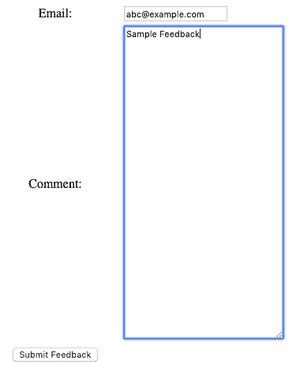

# 在 Spring REST 中处理 URL 编码的表单数据

> 原文：<https://web.archive.org/web/20220930061024/https://www.baeldung.com/spring-url-encoded-form-data>

## 1.概观

对于最终用户来说，表单提交过程非常方便，在某种程度上，相当于只需输入数据并单击提交按钮。然而，从工程的角度来看，需要一种编码机制来可靠地从客户端向服务器端发送和接收这些数据，以便进行后端处理。

就本教程的范围而言，我们将**专注于创建一个表单，在 Spring web 应用程序中以`application/x-www-form-urlencoded`内容类型**发送其数据。

## 2.表单数据编码

表单提交最常用的 HTTP 方法是 POST。但是，对于[幂等](/web/20220707143824/https://www.baeldung.com/cs/idempotent-operations)表单提交，我们也可以使用 HTTP GET 方法。并且，指定方法的方式是通过[表单的方法属性](https://web.archive.org/web/20220707143824/https://www.w3.org/TR/html4/interact/forms.html#adef-method)。

对于使用 GET 方法的表单，整个表单数据作为查询字符串的一部分发送。但是，如果我们使用 POST 方法，那么它的数据将作为 HTTP 请求体的一部分发送。

而且在后一种情况下，我们还可以**用表单的 [`enctype`](https://web.archive.org/web/20220707143824/https://www.w3.org/TR/html4/interact/forms.html#adef-enctype) 属性**指定数据的编码，可以取两个值，分别是`[application/x-www-form-urlencoded](https://web.archive.org/web/20220707143824/https://en.wikipedia.org/wiki/Percent-encoding#The_application.2Fx-www-form-urlencoded_type) `和 [`multipart/form-data`](https://web.archive.org/web/20220707143824/https://en.wikipedia.org/wiki/MIME#Form-Data) 。

### 2.1.媒体类型`application/x-www-form-urlencoded`

HTML **表单的`enctype `属性**有一个默认值`application/x-www-form-urlencoded `,因为这处理了数据完全是文本的基本用例。然而，如果我们的用例涉及支持文件数据，那么我们必须用值`multipart/form-data`覆盖它。

本质上，它以键-值对的形式发送表单数据，键-值对由一个&字符分隔。此外，相应的键和值用等号(=)分隔。此外，所有保留字符和非字母数字字符都使用[百分比编码](https://web.archive.org/web/20220707143824/https://en.wikipedia.org/wiki/Percent-encoding#The_application/x-www-form-urlencoded_type)进行编码。

## 3.在浏览器中提交表单

现在我们已经了解了基础知识，接下来让我们看看如何在一个 Spring web 应用程序中用简单的反馈提交用例来处理 URL 编码的表单数据。

### 3.1.领域模型

对于我们的反馈表单，我们需要捕获提交者的电子邮件标识符以及评论。因此，让我们在一个`Feedback`类中创建我们的**域模型:**

```java
public class Feedback {
    private String emailId;
    private String comment;
}
```

### 3.2.创建表单

要使用一个简单的 HTML 模板来创建我们的动态 web 表单，我们需要在我们的项目中[配置百里香叶](/web/20220707143824/https://www.baeldung.com/spring-web-flash-attributes#1-thymeleaf-configuration)。在这之后，我们准备添加一个 **GET 端点`/feedback`，它将服务于表单**的`feedback`视图:

```java
@GetMapping(path = "/feedback")
public String getFeedbackForm(Model model) {
    Feedback feedback = new Feedback();
    model.addAttribute("feedback", feedback);
    return "feedback";
}
```

注意，我们使用`feedback`作为模型属性来捕捉用户输入。接下来，让我们**在`feedback.html`模板**中创建 **`feedback`视图:**

```java
<form action="#" method="post" th:action="@{/web/feedback}" th:object="${feedback}">
    <!-- form fields for feedback's submitter and comment info -->
</form>
```

当然，我们不需要显式指定`enctype`属性，因为它会选择`application/x-www-form-urlencoded`的默认值。

### 3.3.PRG 流程

当我们通过浏览器反馈表单接受用户输入时，我们必须**实现[发布/重定向/获取](/web/20220707143824/https://www.baeldung.com/spring-web-flash-attributes#1-postredirectget-pattern) (PRG)提交工作流，以避免重复提交**。

首先，让我们实现 POST 端点`/web/feedback `，它将作为反馈表单的动作处理程序:

```java
@PostMapping(
  path = "/web/feedback",
  consumes = {MediaType.APPLICATION_FORM_URLENCODED_VALUE})
public String handleBrowserSubmissions(Feedback feedback) throws Exception {
    // Save feedback data
    return "redirect:/feedback/success";
}
```

接下来，我们可以实现服务于 GET 请求的重定向端点`/feedback/success`:

```java
@GetMapping("/feedback/success")
public ResponseEntity<String> getSuccess() {
    return new ResponseEntity<String>("Thank you for submitting feedback.", HttpStatus.OK);
}
```

要在浏览器中验证表单提交工作流的功能，让我们访问`localhost:8080/feedback`:

[](/web/20220707143824/https://www.baeldung.com/wp-content/uploads/2019/12/feedback_form_web.png)

最后，我们还可以检查表单数据是否以 URL 编码的形式发送:

```java
emailId=abc%40example.com&comment;=Sample+Feedback
```

## 4.非浏览器请求

有时，我们可能没有基于浏览器的 HTTP 客户端。相反，我们的客户可以是公用事业公司，如 [cURL](/web/20220707143824/https://www.baeldung.com/curl-rest) 或 [Postman](/web/20220707143824/https://www.baeldung.com/postman-testing-collections) 。在这种情况下，我们不需要 HTML web 表单。相反，我们可以实现一个服务于 POST 请求的`/feedback`端点:

```java
@PostMapping(
  path = "/feedback",
  consumes = {MediaType.APPLICATION_FORM_URLENCODED_VALUE})
public ResponseEntity<String> handleNonBrowserSubmissions(@RequestBody Feedback feedback) throws Exception {
    // Save feedback data
    return new ResponseEntity<String>("Thank you for submitting feedback", HttpStatus.OK);
}
```

在我们的数据流中没有 HTML 表单的情况下，我们不一定需要实现 PRG 模式。然而，**我们必须指定资源接受`APPLICATION_FORM_URLENCODED_VALUE` 媒体类型**。

最后，我们可以用 cURL 请求来测试它:

```java
curl -X POST \
  http://localhost:8080/feedback \
  -H 'Content-Type: application/x-www-form-urlencoded' \
  -d 'emailId=abc%40example.com&comment;=Sample%20Feedback'
```

### 4.1.`FormHttpMessageConverter`基础知识

发送`application/x-www-form-urlencoded`数据的 HTTP 请求必须在`Content-Type`头中指定这一点。在内部，Spring 使用`[FormHttpMessageConverter](https://web.archive.org/web/20220707143824/https://docs.spring.io/spring/docs/current/javadoc-api/org/springframework/http/converter/FormHttpMessageConverter.html)` 类来读取这些数据，并将其与方法参数绑定。

**在我们的方法参数属于`MultiValueMap`类型的情况下，我们可以使用`[@RequestParam](https://web.archive.org/web/20220707143824/https://docs.spring.io/spring/docs/current/javadoc-api/org/springframework/web/bind/annotation/RequestParam.html)`或`[@RequestBody](https://web.archive.org/web/20220707143824/https://docs.spring.io/spring/docs/current/javadoc-api/org/springframework/web/bind/annotation/RequestBody.html)`注释将其与 HTTP 请求的主体适当绑定。**这是因为 Servlet API 将查询参数和表单数据合并到一个名为`parameters`的映射中，其中包括对请求体的自动解析:

```java
@PostMapping(
  path = "/feedback",
  consumes = {MediaType.APPLICATION_FORM_URLENCODED_VALUE})
public ResponseEntity<String> handleNonBrowserSubmissions(
  @RequestParam MultiValueMap<String,String> paramMap) throws Exception {
    // Save feedback data
    return new ResponseEntity<String>("Thank you for submitting feedback", HttpStatus.OK);
}
```

然而，**对于不同于`MultiValueMap,` 类型的方法参数，比如我们的`Feedback`域对象，我们必须只使用`@RequestBody`注释。**

## 5.结论

在本教程中，我们简要了解了 web 表单中表单数据的编码。我们还探讨了如何通过在 Spring Boot web 应用程序中实现反馈表单来处理浏览器和非浏览器 HTTP 请求的 URL 编码数据。

和往常一样，该教程的完整源代码可以在 GitHub 上的[处获得。](https://web.archive.org/web/20220707143824/https://github.com/eugenp/tutorials/tree/master/spring-web-modules/spring-web-url)