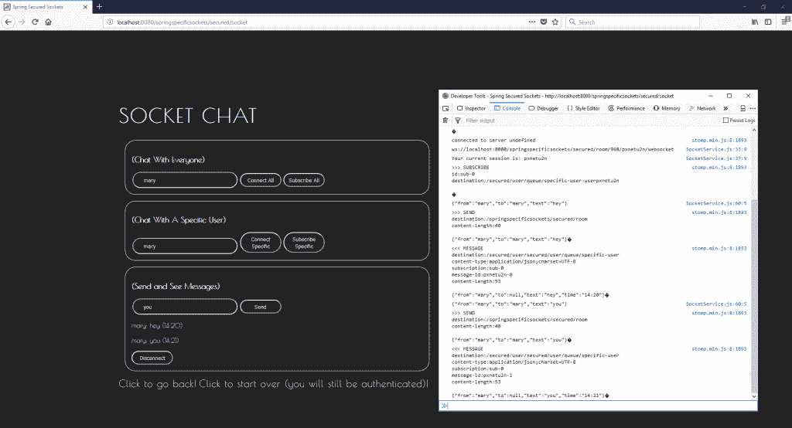
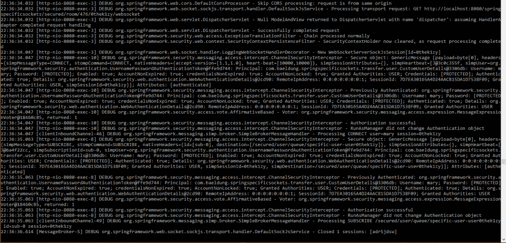

# Spring WebSockets:向特定用户发送消息

> 原文：<https://web.archive.org/web/20220930061024/https://www.baeldung.com/spring-websockets-send-message-to-user>

## 1。简介

在本教程中，我们将描述如何使用 Spring WebSockets 向单个用户发送 STOMP 消息。这很重要，因为我们有时不想向每个用户广播每条消息。除此之外，我们将演示如何以安全的方式发送这些消息。

关于 WebSockets 的介绍，请查看[这篇](/web/20220617075807/https://www.baeldung.com/websockets-spring)很棒的教程，了解如何启动和运行。为了更深入地了解安全性，请查看[这篇](/web/20220617075807/https://www.baeldung.com/spring-security-websockets)文章来保护您的 WebSockets 实现。

## 2。队列、主题和端点

使用 Spring WebSockets 和 STOMP，有三种主要方式来说明消息被发送到哪里以及它们如何订阅到:

1.  **话题**–对任何客户端或用户开放的常见对话或聊天话题
2.  **队列**–为特定用户及其当前会话保留
3.  **端点**–通用端点

现在，让我们快速看一下每个示例的上下文路径:

*   "/主题/电影"
*   "/用户/队列/特定用户"
*   "/安全/聊天"

需要注意的是**我们必须使用队列向特定用户发送消息，因为主题和端点不支持这种功能**。

## 3。配置

现在，让我们学习如何配置我们的应用程序，以便我们可以向特定用户发送消息:

```
public class SocketBrokerConfig extends 
  AbstractWebSocketMessageBrokerConfigurer {

    @Override
    public void configureMessageBroker(MessageBrokerRegistry config) {
        config.enableSimpleBroker("/secured/user/queue/specific-user");
        config.setApplicationDestinationPrefixes("/spring-security-mvc-socket");
        config.setUserDestinationPrefix("/secured/user");
    }

    @Override
    public void registerStompEndpoints(StompEndpointRegistry registry) {
        registry.addEndpoint("/secured/room").withSockJS();
    }
}
```

**让我们确保包含一个用户目的地，因为它决定了哪些端点是为单个用户保留的。**

我们还为所有的队列和用户目的地加上前缀 `“/secured”` ,使它们需要认证。对于未受保护的端点，我们可以丢弃`“/secured”`前缀(作为我们其他安全设置的结果)。

从`pom.xml`的角度来看，不需要额外的依赖。

## 4。URL 映射

我们希望我们的客户端使用符合以下模式的 URL 映射来订阅队列:

```
"/user/queue/updates"
```

这个映射将由`UserDestinationMessageHandler`自动转换成用户会话特定的地址。

例如，如果我们有一个名为`“user123”`的用户，对应的地址应该是:

```
"/queue/updates-user123"
```

在服务器端，我们将使用以下 URL 映射模式发送特定于用户的响应:

```
"/user/{username}/queue/updates"
```

这也将被转换成正确的 URL 映射，我们已经订阅了客户端。

因此，我们看到**这里的基本成分是双重的:**

1.  前置我们指定的用户目的地前缀(在`AbstractWebSocketMessageBrokerConfigurer`中配置)。
2.  在映射中的某处使用`“/queue”`。

在下一节中，我们将看看具体如何做到这一点。

## 5。援引`convertAndSendToUser()`

我们可以从`SimpMessagingTemplate` 或`SimpMessageSendingOperations`非静态地调用 `convertAndSendToUser()`:

```
@Autowired
private SimpMessagingTemplate simpMessagingTemplate;

@MessageMapping("/secured/room") 
public void sendSpecific(
  @Payload Message msg, 
  Principal user, 
  @Header("simpSessionId") String sessionId) throws Exception { 
    OutputMessage out = new OutputMessage(
      msg.getFrom(), 
      msg.getText(),
      new SimpleDateFormat("HH:mm").format(new Date())); 
    simpMessagingTemplate.convertAndSendToUser(
      msg.getTo(), "/secured/user/queue/specific-user", out); 
}
```

你可能已经注意到了:

```
@Header("simpSessionId") String sessionId
```

**`@Header`注释允许访问入站消息公开的头。**例如，我们可以抓取当前的`sessionId`而不需要复杂的拦截器。同样，**我们可以通过`Principal`访问当前用户。**

重要的是，我们在本文中采用的方法在 URL 映射方面提供了比`@sendToUser`注释更好的定制。关于这个注解的更多信息，请查看[这篇](/web/20220617075807/https://www.baeldung.com/spring-websockets-sendtouser)的伟大文章。

在客户端，我们将使用 JavaScript 中的`connect()`来**初始化 SockJS 实例，并使用 STOMP:** 连接到我们的 WebSocket 服务器

```
var socket = new SockJS('/secured/room'); 
var stompClient = Stomp.over(socket);
var sessionId = "";

stompClient.connect({}, function (frame) {
    var url = stompClient.ws._transport.url;
    url = url.replace(
      "ws://localhost:8080/spring-security-mvc-socket/secured/room/",  "");
    url = url.replace("/websocket", "");
    url = url.replace(/^[0-9]+\//, "");
    console.log("Your current session is: " + url);
    sessionId = url;
} 
```

我们还访问提供的`sessionId`，并将其附加到“ `secured/room` `“` URL 映射中。**这使我们能够动态和手动地提供特定于用户的订阅队列:**

```
stompClient.subscribe('secured/user/queue/specific-user' 
  + '-user' + that.sessionId, function (msgOut) {
     //handle messages
} 
```

一旦一切就绪，我们应该会看到:

[](/web/20220617075807/https://www.baeldung.com/wp-content/uploads/2018/09/Specific-Sockets-Specific-1024x554.png)

在我们的服务器控制台中:

[](/web/20220617075807/https://www.baeldung.com/wp-content/uploads/2018/09/Specific-Sockets-Terminal-1024x494.png)

## 6。结论

查看官方 Spring [博客](https://web.archive.org/web/20220617075807/https://assets.spring.io/wp/WebSocketBlogPost.html)和[官方文档](https://web.archive.org/web/20220617075807/https://docs.spring.io/spring-framework/docs/4.3.x/spring-framework-reference/html/websocket.html)以获得关于这个话题的更多信息。

和往常一样，本文中使用的代码示例可以从 GitHub 上的[处获得。](https://web.archive.org/web/20220617075807/https://github.com/eugenp/tutorials/tree/master/spring-security-modules/spring-security-web-sockets)