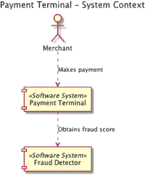
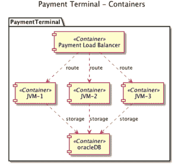
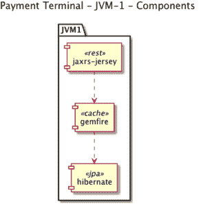
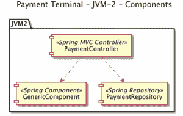

# 结构化器简介

> 原文：<https://web.archive.org/web/20220930061024/https://www.baeldung.com/structurizr>

## 1。简介

这篇文章是关于 Structurizr 的，这是一个工具，它基于 [C4 模型](https://web.archive.org/web/20221128104519/https://www.structurizr.com/help/c4)为架构定义和可视化提供了**编程方法。**

Structurizr 打破了传统的架构图编辑器(如 UML)的拖放方法，允许我们使用我们最熟悉的工具:Java 来描述我们的架构工件。

## 2.入门指南

首先，让我们将 [structurizr-core](https://web.archive.org/web/20221128104519/https://search.maven.org/search?q=a:structurizr-core) 依赖项添加到我们的`pom.xml:`中

```
<dependency>
    <groupId>com.structurizr</groupId>
    <artifactId>structurizr-core</artifactId>
    <version>1.0.0</version>
</dependency>
```

## 3。系统

让我们开始建模一个样本架构。假设我们正在构建一个支持欺诈检测的支付终端，供商家用于结算支付。

首先，我们需要创建一个`Workspace`和一个`Model`:

```
Workspace workspace = new Workspace("Payment Gateway", "Payment Gateway");
Model model = workspace.getModel();
```

我们还在该模型中定义了一个用户和两个软件系统:

```
Person user = model.addPerson("Merchant", "Merchant");
SoftwareSystem paymentTerminal = model.addSoftwareSystem(
  "Payment Terminal", "Payment Terminal");
user.uses(paymentTerminal, "Makes payment");
SoftwareSystem fraudDetector = model.addSoftwareSystem(
  "Fraud Detector", "Fraud Detector");
paymentTerminal.uses(fraudDetector, "Obtains fraud score"); 
```

现在我们的系统已经定义好了，我们可以创建一个视图:

```
ViewSet viewSet = workspace.getViews();

SystemContextView contextView = viewSet.createSystemContextView(
  paymentTerminal, "context", "Payment Gateway Diagram");
contextView.addAllSoftwareSystems();
contextView.addAllPeople();
```

在这里，我们创建了一个包含所有软件系统和人员的视图。现在需要渲染视图。

## 4。通过 PlantUML 查看

在上一节中，我们创建了一个简单支付网关的视图。

下一步是创建一个人性化的图表。对于已经在使用 [PlantUML](https://web.archive.org/web/20221128104519/http://plantuml.com/) 的组织来说，最简单的解决方案可能是指示 Structurizr 进行 PlantUML 导出:

```
StringWriter stringWriter = new StringWriter();
PlantUMLWriter plantUMLWriter = new PlantUMLWriter();
plantUMLWriter.write(workspace, stringWriter);
System.out.println(stringWriter.toString());
```

在这里，生成的标记被打印到屏幕上，但也可以很容易地发送到文件中。以这种方式呈现数据会生成下图:

[](/web/20221128104519/https://www.baeldung.com/wp-content/uploads/2017/06/try.png)

## 5。通过 Structurizr 网站查看

存在另一个呈现图的选项。架构视图可以通过客户端 API 发送到 Structurizr 网站。然后，将使用它们丰富的 UI 生成该图。

让我们可以创建一个 API 客户端:

```
StructurizrClient client = new StructurizrClient("key", "secret");
```

密钥和机密参数可从其网站上的工作区仪表板中获得。然后，可以通过以下方式引用工作区:

```
client.putWorkspace(1337, workspace);
```

显然，我们需要在网站上注册并创建一个工作区。拥有单一工作空间的基本帐户是免费的。同时，商业计划也是可用的。

## 6。集装箱

让我们通过添加一些容器来扩展我们的软件系统。在 C4 模型中，容器可以是 web 应用程序、移动应用程序、桌面应用程序、数据库和文件系统:几乎任何保存代码和/或数据的东西。

首先，我们为支付终端创建一些容器:

```
Container f5 = paymentTerminal.addContainer(
  "Payment Load Balancer", "Payment Load Balancer", "F5");
Container jvm1 = paymentTerminal.addContainer(
  "JVM-1", "JVM-1", "Java Virtual Machine");
Container jvm2 = paymentTerminal.addContainer(
  "JVM-2", "JVM-2", "Java Virtual Machine");
Container jvm3 = paymentTerminal.addContainer(
  "JVM-3", "JVM-3", "Java Virtual Machine");
Container oracle = paymentTerminal.addContainer(
  "oracleDB", "Oracle Database", "RDBMS");
```

接下来，我们定义这些新创建的元素之间的关系:

```
f5.uses(jvm1, "route");
f5.uses(jvm2, "route");
f5.uses(jvm3, "route");

jvm1.uses(oracle, "storage");
jvm2.uses(oracle, "storage");
jvm3.uses(oracle, "storage");
```

最后，创建一个可以提供给呈现器的容器视图:

```
ContainerView view = workspace.getViews()
  .createContainerView(paymentTerminal, "F5", "Container View");
view.addAllContainers();
```

通过 PlantUML 呈现结果图会产生:

[](/web/20221128104519/https://www.baeldung.com/wp-content/uploads/2017/06/Containers.png)

## 7。组件

组件视图提供了 C4 模型的下一个细节层次。创建一个类似于我们之前所做的。

首先，我们在容器中创建一些组件:

```
Component jaxrs = jvm1.addComponent("jaxrs-jersey", 
  "restful webservice implementation", "rest");
Component gemfire = jvm1.addComponent("gemfire", 
  "Clustered Cache Gemfire", "cache");
Component hibernate = jvm1.addComponent("hibernate", 
  "Data Access Layer", "jpa");
```

接下来，让我们添加一些关系:

```
jaxrs.uses(gemfire, "");
gemfire.uses(hibernate, "");
```

最后，让我们创建视图:

```
ComponentView componentView = workspace.getViews()
  .createComponentView(jvm1, JVM_COMPOSITION, "JVM Components");

componentView.addAllComponents();
```

通过 PlantUML 呈现结果图会产生:

[](/web/20221128104519/https://www.baeldung.com/wp-content/uploads/2017/06/Components.png)

## 8。成分提取

对于使用 Spring 框架的现有代码库，Structurizr 提供了一种自动化的方法来提取带有 Spring 注释的组件，并将它们添加到架构构件中。

为了利用这个特性，我们需要添加另一个依赖项:

```
<dependency>
    <groupId>com.structurizr</groupId>
    <artifactId>structurizr-spring</artifactId>
    <version>1.0.0-RC5</version>
</dependency>
```

接下来，我们需要创建一个配置了一个或多个解析策略的`ComponentFinder`。解析策略会影响诸如哪些组件将被添加到模型中、依赖树遍历的深度等等。

**我们甚至可以插入自定义解决策略:**

```
ComponentFinder componentFinder = new ComponentFinder(
  jvm, "com.baeldung.structurizr",
  new SpringComponentFinderStrategy(
    new ReferencedTypesSupportingTypesStrategy()
  ),
  new SourceCodeComponentFinderStrategy(new File("/path/to/base"), 150));
```

最后，我们启动查找器:

```
componentFinder.findComponents();
```

上面的代码扫描包`com.baeldung.structurizr`中带有 Spring 注释的 beans，并将它们作为组件添加到容器 JVM 中。不用说，我们可以自由实现我们自己的扫描器、JAX-RS 注释资源，甚至 Google Guice 绑定器。

下面是一个简单项目的简单图表示例:

[](/web/20221128104519/https://www.baeldung.com/wp-content/uploads/2017/06/spring.png)

## 9。结论

这个快速教程涵盖了 Java 项目的 Structurizr 的基础知识。

和往常一样，可以在 GitHub 上找到示例代码[。](https://web.archive.org/web/20221128104519/https://github.com/eugenp/tutorials/tree/master/libraries-3)