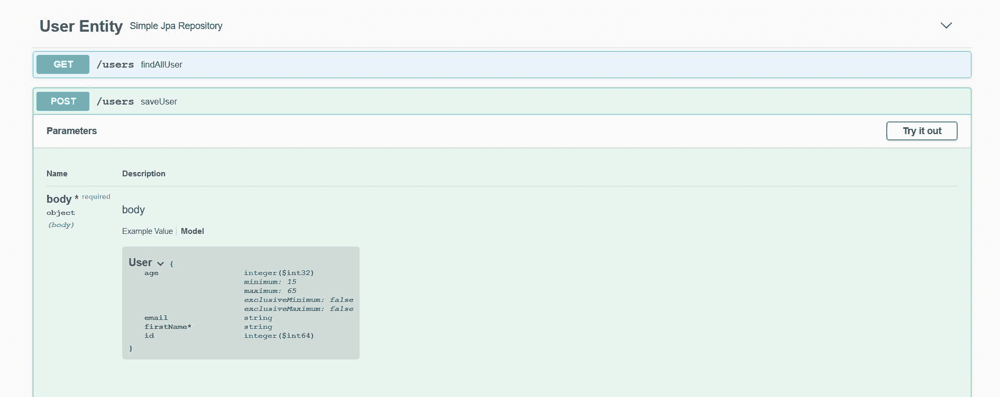
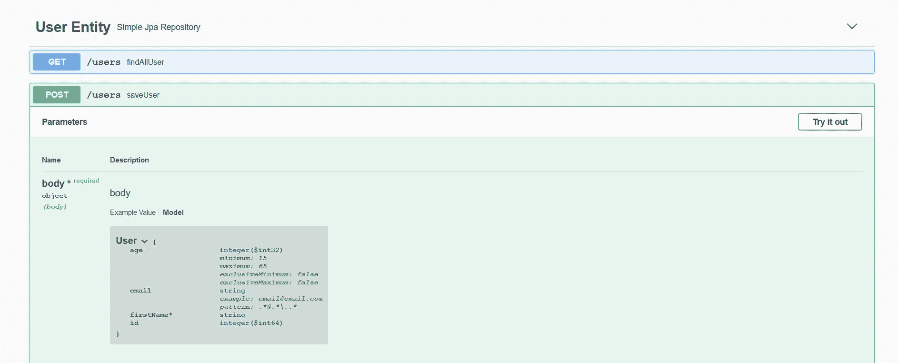
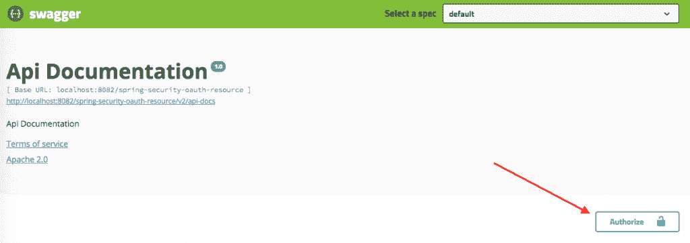
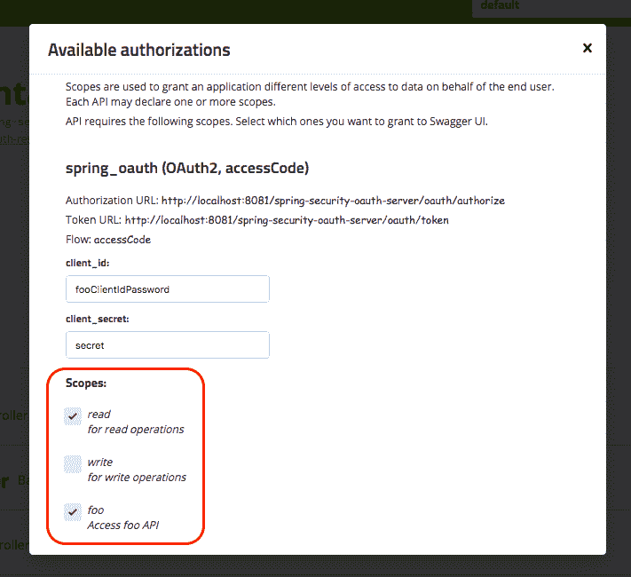
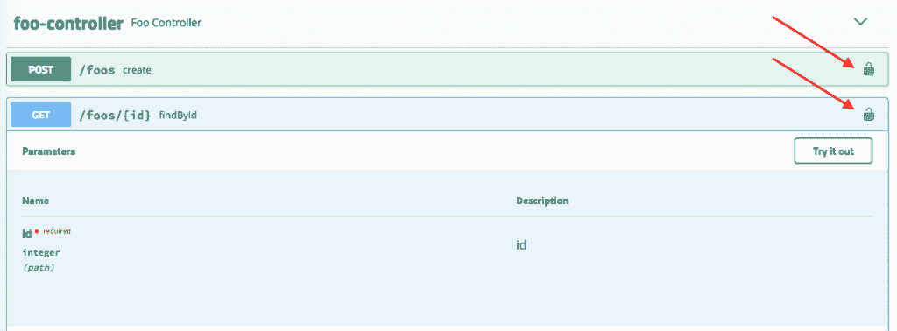

# 使用 Springfox 用 Spring REST API 设置 Swagger 2

> 原文：<https://web.archive.org/web/20220930061024/https://www.baeldung.com/swagger-2-documentation-for-spring-rest-api>

## 1。概述

如今，前端和后端组件通常会分离一个 web 应用程序。通常，我们将 API 公开为前端组件或第三方应用集成的后端组件。

在这种情况下，为后端 API 制定适当的规范是至关重要的。同时，API 文档应该信息丰富，可读性强，易于理解。

此外，参考文档应该同时描述 API 中的每个变化。手动完成这项工作是一项繁琐的工作，因此自动化过程是不可避免的。

在本教程中，我们将研究 Spring REST web 服务的 **Swagger 2，使用 Swagger 2 规范的 Springfox 实现。值得一提的是，最新版本的 Swagger 规范，现在被称为 OpenAPI 3.0，被 Springdoc 项目更好地支持，应该用于[记录 Spring REST API](/web/20220815131030/https://www.baeldung.com/spring-rest-openapi-documentation) 。**

如果您不熟悉 Swagger，请在继续本教程之前访问[的网页](https://web.archive.org/web/20220815131030/http://swagger.io/)了解更多信息。

## 延伸阅读:

## [生成带有 Swagger 的 Spring Boot REST 客户端](/web/20220815131030/https://www.baeldung.com/spring-boot-rest-client-swagger-codegen)

Learn how you can generate a Spring Boot REST client using Swagger Code generator.[Read more](/web/20220815131030/https://www.baeldung.com/spring-boot-rest-client-swagger-codegen) →

## [春假单据介绍](/web/20220815131030/https://www.baeldung.com/spring-rest-docs)

This article introduces Spring REST Docs, a test-driven mechanism to generate documentation for RESTful services that is both accurate and readable.[Read more](/web/20220815131030/https://www.baeldung.com/spring-rest-docs) →

## [Java 中的 Asciidoctor 简介](/web/20220815131030/https://www.baeldung.com/asciidoctor)

Learn how to generate documents using AsciiDoctor.[Read more](/web/20220815131030/https://www.baeldung.com/asciidoctor) →

## 2。目标项目

我们将使用的 REST 服务的创建不在本文的讨论范围之内。如果你已经有一个合适的项目，那就使用它。如果没有，这些链接是一个很好的起点:

*   [用 Spring 4 和 Java 配置文章构建 REST API](/web/20220815131030/https://www.baeldung.com/building-a-restful-web-service-with-spring-and-java-based-configuration)
*   [构建 RESTful Web 服务](https://web.archive.org/web/20220815131030/https://spring.io/guides/gs/rest-service/)

## 3。添加 Maven 依赖关系

如上所述，我们将使用 Swagger 规范的 Springfox 实现。最新版本可以在 Maven Central 上找到[。](https://web.archive.org/web/20220815131030/https://search.maven.org/classic/#search%7Cga%7C1%7C%22Springfox%20Swagger2%22 "Spring Security on Maven Central")

为了将它添加到我们的 Maven 项目中，我们需要在`pom.xml`文件中添加一个依赖项:

```java
<dependency>
    <groupId>io.springfox</groupId>
    <artifactId>springfox-swagger2</artifactId>
    <version>3.0.0</version>
</dependency>
```

### 3.1.Spring Boot 属地

对于基于 Spring Boot 的项目，**添加一个`springfox-boot-starter`依赖项**就足够了:

```java
<dependency>
    <groupId>io.springfox</groupId>
    <artifactId>springfox-boot-starter</artifactId>
    <version>3.0.0</version>
</dependency>
```

我们可以添加我们需要的任何其他启动器，其中一个版本由 Spring Boot 母公司管理:

```java
<dependency>
    <groupId>org.springframework.boot</groupId>
    <artifactId>spring-boot-starter-parent</artifactId>
    <version>2.4.0</version>
</dependency>
```

## 4。将 Swagger 2 整合到项目中

### 4.1。Java 配置

Swagger 的配置主要围绕`**Docket**` bean 展开:

```java
@Configuration
public class SpringFoxConfig {                                    
    @Bean
    public Docket api() { 
        return new Docket(DocumentationType.SWAGGER_2)  
          .select()                                  
          .apis(RequestHandlerSelectors.any())              
          .paths(PathSelectors.any())                          
          .build();                                           
    }
}
```

在定义了`Docket` bean 之后，它的`select()`方法返回一个`ApiSelectorBuilder`的实例，该实例提供了一种控制由 Swagger 公开的端点的方法。

我们可以在`RequestHandlerSelectors`和`PathSelectors`的帮助下配置选择`RequestHandler`的谓词。对两者都使用`any()`将使我们整个 API 的文档可以通过 Swagger 获得。

### 4.2。不带 Spring Boot 的配置

在普通的 Spring 项目中，我们需要显式地启用 Swagger 2。为此，**我们必须在我们的配置类**上使用`@EnableSwagger2WebMvc`:

```java
@Configuration
@EnableSwagger2WebMvc
public class SpringFoxConfig {                                    
}
```

此外，没有 Spring Boot，我们就没有自动配置资源处理程序的奢侈。

Swagger UI 添加了一组资源，我们必须将它们配置为扩展`WebMvcConfigurerAdapter`并使用`@EnableWebMvc:`注释的类的一部分

```java
@Override
public void addResourceHandlers(ResourceHandlerRegistry registry) {
    registry.addResourceHandler("swagger-ui.html")
      .addResourceLocations("classpath:/META-INF/resources/");

    registry.addResourceHandler("/webjars/**")
      .addResourceLocations("classpath:/META-INF/resources/webjars/");
}
```

### 4.3。验证

为了验证 Springfox 是否正常工作，我们可以在浏览器中访问这个 URL:

`http://localhost:8080/spring-security-rest/api/v2/api-docs`

结果是一个带有大量键值对的 JSON 响应，可读性不是很好。幸运的是，Swagger 为此提供了 **Swagger UI** 。

## 5。Swagger UI

Swagger UI 是一个内置的解决方案，它使得用户与 Swagger 生成的 API 文档的交互更加容易。

### 5.1。启用 Springfox 的 Swagger UI

要使用 Swagger UI，我们需要添加一个额外的 Maven 依赖项:

```java
<dependency>
    <groupId>io.springfox</groupId>
    <artifactId>springfox-swagger-ui</artifactId>
    <version>3.0.0</version>
</dependency>
```

现在，我们可以在浏览器中测试它，方法是访问:

`http://localhost:8080/your-app-root/swagger-ui/`

顺便说一下，在我们的例子中，确切的 URL 将是:

`http://localhost:8080/spring-security-rest/api/swagger-ui/`

结果应该是这样的:

[](/web/20220815131030/https://www.baeldung.com/wp-content/uploads/2016/07/Screenshot_11.png)

### 5.2。探索 Swagger 文档

在 Swagger 的响应中有一个在我们的应用程序中定义的所有控制器的列表。点击其中任何一个都会列出有效的 HTTP 方法(`DELETE`、`GET`、`HEAD`、`OPTIONS`、`PATCH`、`POST`、`PUT`)。

扩展每个方法可以提供额外的有用数据，比如响应状态、内容类型和参数列表。也可以使用 UI 尝试每种方法。

Swagger 与我们的代码库同步的能力至关重要。为了演示这一点，我们可以向我们的应用程序添加一个新的控制器:

```java
@RestController
public class CustomController {

    @RequestMapping(value = "/custom", method = RequestMethod.POST)
    public String custom() {
        return "custom";
    }
}
```

现在，如果我们刷新 Swagger 文档，我们会在控制器列表中看到**自定义控制器**。我们知道，斯瓦格的回应中显示的方法只有一个(`POST`)。

## 6.弹簧数据架

Springfox 通过其 [`springfox-data-rest`](https://web.archive.org/web/20220815131030/https://search.maven.org/search?q=g:io.springfox%20a:springfox-data-rest) 库为 [Spring Data REST](/web/20220815131030/https://www.baeldung.com/spring-data-rest-intro) 提供支持。

**如果 Spring Boot 在类路径**上发现了`spring-boot-starter-data-rest`，它将负责自动配置。

现在让我们创建一个名为`User`的实体:

```java
@Entity
public class User {
    @Id
    private Long id;
    private String firstName;
    private int age;
    private String email;

    // getters and setters
}
```

然后我们将创建`UserRepository`来添加对`User`实体的 CRUD 操作:

```java
@Repository
public interface UserRepository extends CrudRepository<User, Long> {
}
```

最后，我们将把 [`SpringDataRestConfiguration`](https://web.archive.org/web/20220815131030/https://springfox.github.io/springfox/javadoc/current/springfox/documentation/spring/data/rest/configuration/SpringDataRestConfiguration.html) 类导入到`SpringFoxConfig` 类中:

```java
@EnableSwagger2WebMvc
@Import(SpringDataRestConfiguration.class)
public class SpringFoxConfig {
    //...
}
```

注意:我们使用了`@EnableSwagger2WebMvc` 注释来启用 Swagger，因为它已经取代了库版本 3 中的`@EnableSwagger2` 注释。

让我们重新启动应用程序，为 Spring Data REST APIs 生成规范:

[](/web/20220815131030/https://www.baeldung.com/wp-content/uploads/2015/12/swagger_user_1.jpg)

我们可以看到 Springfox 已经用 HTTP 方法为`User`实体生成了规范，比如`GET`、`POST, PUT, PATCH,`和`DELETE.`

## 7.Bean 验证

Springfox 还通过其 [`springfox-bean-validators`](https://web.archive.org/web/20220815131030/https://search.maven.org/search?q=g:io.springfox%20a:springfox-bean-validators) 库支持 [bean 验证](/web/20220815131030/https://www.baeldung.com/javax-validation)注释。

首先，我们将把 Maven 依赖项添加到我们的`pom.xml`:

```java
<dependency>
    <groupId>io.springfox</groupId>
    <artifactId>springfox-bean-validators</artifactId>
    <version>2.9.2</version>
</dependency>
```

同样，**如果我们使用 Spring Boot，我们不必显式地提供上述依赖关系**。

接下来，让我们给`User`实体添加几个验证注释，如 [`@NotNull`](https://web.archive.org/web/20220815131030/https://docs.oracle.com/javaee/7/api/javax/validation/constraints/NotNull.html) 和 [`@Min`](https://web.archive.org/web/20220815131030/https://docs.oracle.com/javaee/7/api/javax/validation/constraints/Min.html) :

```java
@Entity
public class User {
    //...

    @NotNull(message = "First Name cannot be null")
    private String firstName;

    @Min(value = 15, message = "Age should not be less than 15")
    @Max(value = 65, message = "Age should not be greater than 65")
    private int age;
}
```

最后，我们将把 [`BeanValidatorPluginsConfiguration`](https://web.archive.org/web/20220815131030/https://springfox.github.io/springfox/javadoc/current/springfox/bean/validators/configuration/BeanValidatorPluginsConfiguration.html) 类导入到`SpringFoxConfig` 类中:

```java
@EnableSwagger2
@Import(BeanValidatorPluginsConfiguration.class)
public class SpringFoxConfig {
    //...
}
```

让我们来看看 API 规范的变化:

[](/web/20220815131030/https://www.baeldung.com/wp-content/uploads/2015/12/swagger_user_2.jpg)

在这里，我们可以观察到`User`模型在`firstName`上有`* required`。此外，`minimum`和`maximum`值是为`age`定义的。

## 8.插件

为了给 API 规范添加特定的特性，我们可以创建一个 Springfox 插件。插件可以提供各种特性，从丰富模型和属性到定制 API 列表和缺省值。

Springfox 通过其 [spi](https://web.archive.org/web/20220815131030/https://github.com/springfox/springfox/tree/master/springfox-spi/src/main/java/springfox/documentation/spi) 模块支持插件创建。spi 模块提供了一些接口，如 [`ModelBuilderPlugin`](https://web.archive.org/web/20220815131030/https://springfox.github.io/springfox/javadoc/current/springfox/documentation/spi/schema/ModelBuilderPlugin.html) 、 [`ModelPropertyBuilderPlugin`](https://web.archive.org/web/20220815131030/https://springfox.github.io/springfox/javadoc/current/springfox/documentation/spi/schema/ModelPropertyBuilderPlugin.html) 和`[ApiListingBuilderPlugin](https://web.archive.org/web/20220815131030/https://springfox.github.io/springfox/javadoc/current/springfox/documentation/spi/service/ApiListingBuilderPlugin.html)`，这些接口作为可扩展性挂钩来实现自定义插件。

为了演示这些功能，让我们创建一个插件来丰富`User`模型的`email`属性。我们将使用`ModelPropertyBuilderPlugin` 接口并设置`pattern`和`example`的值。

首先，让我们创建`EmailAnnotationPlugin`类并覆盖`supports`方法以允许任何[文档类型](https://web.archive.org/web/20220815131030/https://springfox.github.io/springfox/javadoc/current/springfox/documentation/spi/DocumentationType.html)，比如 Swagger 1.2 和 Swagger 2:

```java
@Component
@Order(Validators.BEAN_VALIDATOR_PLUGIN_ORDER)
public class EmailAnnotationPlugin implements ModelPropertyBuilderPlugin {
    @Override
    public boolean supports(DocumentationType delimiter) {
        return true;
    }
}
```

然后我们将覆盖`ModelPropertyBuilderPlugin` 的`apply`方法来设置构建器属性的值:

```java
@Override
public void apply(ModelPropertyContext context) {
    Optional<Email> email = annotationFromBean(context, Email.class);
     if (email.isPresent()) {
        context.getSpecificationBuilder().facetBuilder(StringElementFacetBuilder.class)
          .pattern(email.get().regexp());
        context.getSpecificationBuilder().example("[[email protected]](/web/20220815131030/https://www.baeldung.com/cdn-cgi/l/email-protection)");
    }
}
```

因此，API 规范将显示用`@Email` 注释标注的属性的`pattern`和`example`值。

接下来，我们将把`@Email`注释添加到`User`实体中:

```java
@Entity
public class User {
    //...

    @Email(regexp=".*@.*\\..*", message = "Email should be valid")
    private String email;
}
```

最后，我们将通过注册为 bean 来启用`SpringFoxConfig` 类中的`EmailAnnotationPlugin`:

```java
@Import({BeanValidatorPluginsConfiguration.class})
public class SpringFoxConfig {
    //...

    @Bean
    public EmailAnnotationPlugin emailPlugin() {
        return new EmailAnnotationPlugin();
    }
}
```

让我们来看看正在运行的`EmailAnnotationPlugin`:

[](/web/20220815131030/https://www.baeldung.com/wp-content/uploads/2015/12/swagger_user_3.jpg)

我们可以看到`pattern`的值是相同的 regex(。*@.*\\..*)来自`User`实体的`email`属性。

类似地，`example` ( [【电子邮件保护】](/web/20220815131030/https://www.baeldung.com/cdn-cgi/l/email-protection))的值是相同的，正如在`EmailAnnotationPlugin`的`apply`方法中所定义的。

## 9。高级配置

我们的应用程序的`Docket` bean 可以被配置为给我们提供对 API 文档生成过程的更多控制。

### 9.1。Swagger 响应的过滤 API

公开整个 API 的文档并不总是可取的。我们可以通过向`Docket`类的`**apis()**`和`**paths()**`方法传递参数来限制 Swagger 的响应。

如上所述，`RequestHandlerSelectors`允许使用`any`或`none`谓词，但是也可以用于根据基础包、类注释和方法注释过滤 API。

`**PathSelectors**`用谓词提供额外的过滤，它扫描我们的应用程序的请求路径。我们可以用`any()`、`none(),` 、T3、`ant()`。

在下面的例子中，我们将使用`ant()`谓词指示 Swagger 只包含特定包中的控制器，以及特定的路径:

```java
@Bean
public Docket api() {                
    return new Docket(DocumentationType.SWAGGER_2)          
      .select()                                       
      .apis(RequestHandlerSelectors.basePackage("com.baeldung.web.controller"))
      .paths(PathSelectors.ant("/foos/*"))                     
      .build();
}
```

### 9.2。自定义信息

Swagger 在它的响应中也提供了一些默认值，我们可以自定义，比如“Api 文档”、“由联系人邮件创建”、“Apache 2.0”。

要更改这些值，我们可以使用 **`apiInfo(ApiInfo apiInfo)`** 方法——包含关于 API 的定制信息的 **`ApiInfo`** 类:

```java
@Bean
public Docket api() {                
    return new Docket(DocumentationType.SWAGGER_2)          
      .select()
      .apis(RequestHandlerSelectors.basePackage("com.example.controller"))
      .paths(PathSelectors.ant("/foos/*"))
      .build()
      .apiInfo(apiInfo());
}

private ApiInfo apiInfo() {
    return new ApiInfo(
      "My REST API", 
      "Some custom description of API.", 
      "API TOS", 
      "Terms of service", 
      new Contact("John Doe", "www.example.com", "[[email protected]](/web/20220815131030/https://www.baeldung.com/cdn-cgi/l/email-protection)"), 
      "License of API", "API license URL", Collections.emptyList());
}
```

### 9.3。自定义方法响应消息

Swagger 允许**通过`Docket`的 **`globalResponses()`** 方法全局覆盖 HTTP 方法**的响应消息。

首先，我们需要指示 Swagger 不要使用默认响应消息。假设我们想要覆盖所有`GET`方法的 **500** 和 **403** 响应消息。

为了实现这一点，必须将一些代码添加到`Docket`的初始化块中(为了清楚起见，原始代码被排除在外):

```java
.useDefaultResponseMessages(false)
.globalResponses(HttpMethod.GET, newArrayList(
    new ResponseBuilder().code("500")
        .description("500 message").build(),
    new ResponseBuilder().code("403")
        .description("Forbidden!!!!!").build()
));
```

[](/web/20220815131030/https://www.baeldung.com/wp-content/uploads/2016/07/Screenshot_2.png)

## 10。带有 OAuth 安全 API 的 swagger UI

Swagger UI 提供了许多非常有用的特性，到目前为止我们已经很好地介绍过了。但是如果我们的 API 是安全的和不可访问的，我们就不能真正使用其中的大部分。

在这个例子中，让我们看看如何允许 Swagger 使用授权代码授权类型访问 OAuth 保护的 API。

我们将配置 Swagger 使用`SecurityScheme`和`SecurityContext`支持来访问我们的安全 API:

```java
@Bean
public Docket api() {
    return new Docket(DocumentationType.SWAGGER_2).select()
        .apis(RequestHandlerSelectors.any())
        .paths(PathSelectors.any())
        .build()
        .securitySchemes(Arrays.asList(securityScheme()))
        .securityContexts(Arrays.asList(securityContext()));
}
```

### 10.1。安全配置

我们将在我们的 Swagger 配置中定义一个`SecurityConfiguration` bean，并设置一些默认值:

```java
@Bean
public SecurityConfiguration security() {
    return SecurityConfigurationBuilder.builder()
        .clientId(CLIENT_ID)
        .clientSecret(CLIENT_SECRET)
        .scopeSeparator(" ")
        .useBasicAuthenticationWithAccessCodeGrant(true)
        .build();
}
```

### 10.2。`SecurityScheme`

接下来，我们将定义我们的`SecurityScheme`；这用来描述我们的 API 是如何被保护的(基本认证，OAuth2，…)。

在我们的例子中，我们将定义一个 OAuth 方案，用于保护我们的[资源服务器](/web/20220815131030/https://www.baeldung.com/rest-api-spring-oauth2-angular):

```java
private SecurityScheme securityScheme() {
    GrantType grantType = new AuthorizationCodeGrantBuilder()
        .tokenEndpoint(new TokenEndpoint(AUTH_SERVER + "/token", "oauthtoken"))
        .tokenRequestEndpoint(
          new TokenRequestEndpoint(AUTH_SERVER + "/authorize", CLIENT_ID, CLIENT_SECRET))
        .build();

    SecurityScheme oauth = new OAuthBuilder().name("spring_oauth")
        .grantTypes(Arrays.asList(grantType))
        .scopes(Arrays.asList(scopes()))
        .build();
    return oauth;
}
```

注意，我们使用了授权代码授权类型，为此我们需要提供一个令牌端点和 OAuth2 授权服务器的授权 URL。

这里是我们需要定义的范围:

```java
private AuthorizationScope[] scopes() {
    AuthorizationScope[] scopes = { 
      new AuthorizationScope("read", "for read operations"), 
      new AuthorizationScope("write", "for write operations"), 
      new AuthorizationScope("foo", "Access foo API") };
    return scopes;
}
```

这些与我们在应用程序中为`/foos` API 定义的作用域同步。

### 10.3。`SecurityContext`

最后，我们需要为我们的示例 API 定义一个`SecurityContext`:

```java
private SecurityContext securityContext() {
    return SecurityContext.builder()
      .securityReferences(
        Arrays.asList(new SecurityReference("spring_oauth", scopes())))
      .forPaths(PathSelectors.regex("/foos.*"))
      .build();
}
```

请注意我们在引用中使用的名称— `spring_oauth` —是如何与我们之前在`SecurityScheme`中使用的名称同步的。

### 10.4。测试

既然我们已经做好了一切准备，让我们看看我们的 Swagger UI 并尝试访问 Foo API。

我们可以在本地访问 Swagger UI:

```java
http://localhost:8082/spring-security-oauth-resource/swagger-ui.html
```

如我们所见，由于我们的安全配置，现在有了一个新的授权按钮:

[](/web/20220815131030/https://www.baeldung.com/wp-content/uploads/2015/12/swagger_1-1024x362.png)

当我们单击 Authorize 按钮时，我们可以看到下面的弹出窗口，授权我们的 Swagger UI 访问受保护的 API:

[](/web/20220815131030/https://www.baeldung.com/wp-content/uploads/2015/12/swagger_2.png)

请注意:

*   我们已经可以看到 CLIENT_ID 和 CLIENT_SECRET，因为我们已经在前面对它们进行了预配置(但是我们仍然可以更改它们)。
*   我们现在可以选择我们需要的范围。

下面是安全 API 的标记方式:

[](/web/20220815131030/https://www.baeldung.com/wp-content/uploads/2015/12/swagger_3-1024x378.png)

现在，我们终于可以使用我们的 API 了！

当然，不言而喻，我们需要注意如何对外公开 Swagger UI，因为现在这个安全配置是活动的。

## 11。结论

在本文中，我们设置了 Swagger 2 来为 Spring REST API 生成文档。我们还探索了可视化和定制 Swagger 输出的方法。最后，我们看了一个简单的 OAuth 配置。

本教程的**完整实现**可以在[的 GitHub 项目](https://web.archive.org/web/20220815131030/https://github.com/eugenp/tutorials/tree/master/spring-security-modules/spring-security-web-rest)中找到。要查看启动项目的设置，请查看[GitHub 模块](https://web.archive.org/web/20220815131030/https://github.com/eugenp/tutorials/tree/master/spring-boot-modules/spring-boot-mvc)。

对于 OAuth 部分，代码可以在我们的 [spring-security-oauth](https://web.archive.org/web/20220815131030/https://github.com/Baeldung/spring-security-oauth/tree/master/oauth-legacy) 存储库中找到。

如果你是 REST With Spring 的学生[，请进入模块 7 的第 1 课，深入了解如何使用 Spring 和 Spring Boot 设置 Swagger。](/web/20220815131030/https://www.baeldung.com/rest-with-spring-course#master-class)