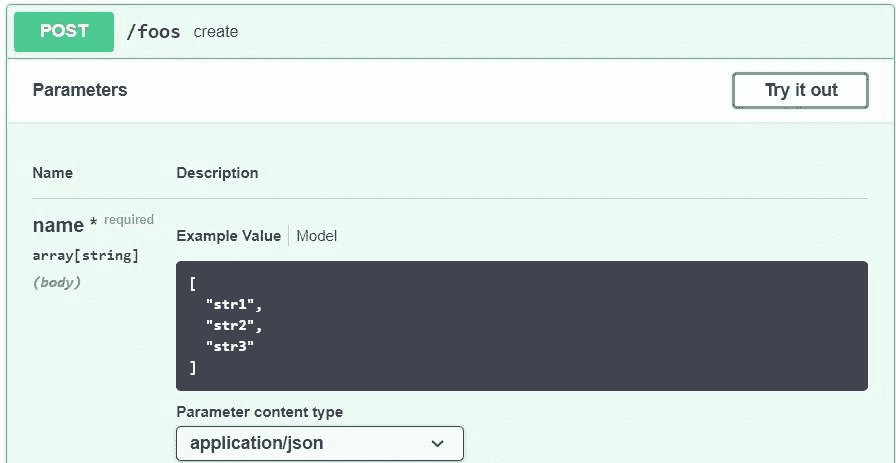

# 在 Swagger 中将字符串数组指定为主体参数

> 原文：<https://web.archive.org/web/20220930061024/https://www.baeldung.com/swagger-body-array-of-strings>

## 1.概观

Swagger 是一组规范，用来记录和描述 REST APIs。它还提供了端点参数的示例值。

在本教程中，我们将展示如何为`String`数组生成一个默认的示例值，因为默认情况下这种行为是不启用的。

## 2.在 Swagger 中将字符串数组指定为主体参数

当我们想在 Swagger 中将一个字符串数组指定为主体参数时，问题就出现了。

Swagger 的默认示例值有点不透明，我们可以在[中看到 Swagger 编辑器](https://web.archive.org/web/20220707143818/https://editor.swagger.io/):

[](/web/20220707143818/https://www.baeldung.com/wp-content/uploads/2020/01/swagger-description-array-without-example-1.jpg)

因此，这里我们看到 Swagger 并没有真正展示数组内容应该是什么样子的例子。我们来看看怎么加一个。

## 3.亚姆

首先，我们从使用 YAML 符号在 Swagger 中指定字符串数组开始。在模式部分，我们将`type: array` 和` items String`放在一起。

为了更好地记录 API 并指导用户，我们可以使用如何插入值的`example`标签:

```java
parameters:
  - in: body
    description: ""
    required: true
    name: name
    schema:
      type: array
      items:
        type: string
      example: ["str1", "str2", "str3"]
```

让我们看看现在我们的显示内容如何更加丰富:

[](/web/20220707143818/https://www.baeldung.com/wp-content/uploads/2020/01/swagger-description-array-1.jpg)

## 4\. Springfox

或者，我们可以使用 [Springfox](https://web.archive.org/web/20220707143818/https://www.google.com/search?client=safari&rls=en&q=springfox+baeldung&ie=UTF-8&oe=UTF-8) 达到同样的结果。

我们需要使用数据模型中的`dataType`和`example`以及`@ApiModel` 和`@ApiModelProperty` 注释:

```java
@ApiModel
public class Foo {
    private long id;
    @ApiModelProperty(name = "name", dataType = "List", example = "[\"str1\", \"str2\", \"str3\"]")
    private List<String> name;
```

之后，我们还需要对`Controller `进行注释，让 Swagger 指向数据模型。

所以，让我们用`@ApiImplicitParams` 来表示:

```java
@RequestMapping(method = RequestMethod.POST, value = "/foos")
@ResponseStatus(HttpStatus.CREATED)
@ResponseBody
@ApiImplicitParams({ @ApiImplicitParam(name = "foo", 
  value = "List of strings", paramType = "body", dataType = "Foo") })
public Foo create(@RequestBody final Foo foo) {
```

就是这样！

## 5.结论

当记录 REST APIs 时，我们可能有字符串数组的参数。理想情况下，我们会用示例值来记录这些。

我们可以用 `example`属性大摇大摆地做到这一点。或者，我们可以使用 Springfox 中的`example ` annotation 属性。

和往常一样，代码可以在 GitHub 的[上获得。](https://web.archive.org/web/20220707143818/https://github.com/eugenp/tutorials/tree/master/spring-boot-modules/spring-boot-mvc-2)