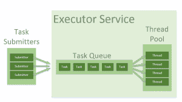

# Java 线程池简介

> 原文：<https://web.archive.org/web/20220930061024/https://www.baeldung.com/thread-pool-java-and-guava>

## 1。概述

本教程介绍了 Java 中的线程池。我们将从标准 Java 库中的不同实现开始，然后看看 Google 的 Guava 库。

## 延伸阅读:

## [Java 中线程和虚拟线程的区别](/web/20220929100635/https://www.baeldung.com/java-virtual-thread-vs-thread)

A quick and practical comparison between Threads and Virtual Threads in Java.[Read more](/web/20220929100635/https://www.baeldung.com/java-virtual-thread-vs-thread) →

## [ExecutorService–等待线程完成](/web/20220929100635/https://www.baeldung.com/java-executor-wait-for-threads)

Learn how to use ExecutorService in various scenarios to wait for threads to finish their execution.[Read more](/web/20220929100635/https://www.baeldung.com/java-executor-wait-for-threads) →

## [Java 8 并行流中的自定义线程池](/web/20220929100635/https://www.baeldung.com/java-8-parallel-streams-custom-threadpool)

Brief intro to custom thread pools and their use in Java 8 parallel streams.[Read more](/web/20220929100635/https://www.baeldung.com/java-8-parallel-streams-custom-threadpool) →

## 2。线程池

在 Java 中，线程被映射到系统级线程，即操作系统的资源。如果我们不受控制地创建线程，我们可能会很快耗尽这些资源。

为了模拟并行性，操作系统还在线程之间进行上下文切换。一个简单的观点是，我们产生的线程越多，每个线程花费在实际工作上的时间就越少。

线程池模式有助于节省多线程应用程序中的资源，并将并行性限制在某些预定义的范围内。

当我们使用线程池时，我们以并行任务的形式编写并发代码，并将它们提交给线程池的一个实例来执行。这个实例控制几个重用的线程来执行这些任务。
T3

该模式允许我们**控制应用程序创建的线程数量**和它们的生命周期。我们还能够调度任务的执行，并将传入的任务放在队列中。

## 3。Java 中的线程池

### 3.1。`Executors`、`Executor`和`ExecutorService`、

`Executors` helper 类包含几个创建预配置线程池实例的方法。这些课程是一个很好的起点。如果我们不需要应用任何定制的微调，我们可以使用它们。

我们使用`Executor`和`ExecutorService`接口来处理 Java 中不同的线程池实现。通常，我们应该**保持我们的代码与线程池**的实际实现解耦，并在整个应用程序中使用这些接口。

#### 3.1.1。`Executor`

**`Executor`接口有一个单独的`execute`方法来提交`Runnable`实例以供执行。**

**让我们看一个简单的例子**，如何使用`Executors` API 来获取一个由单线程池和无限队列支持的`Executor`实例，以便顺序执行任务。

这里，我们运行一个简单的任务，在屏幕上打印“Hello World `“`”。我们将任务作为 lambda(Java 8 的一个特性)提交，推断为`Runnable`:

```java
Executor executor = Executors.newSingleThreadExecutor();
executor.execute(() -> System.out.println("Hello World"));
```

#### 3.1.2。`ExecutorService`

接口`ExecutorService`包含了大量的方法来**控制任务的进程和管理服务的终止。使用这个接口，我们可以提交任务来执行，并且使用返回的`Future`实例来控制它们的执行。**

现在我们将创建一个`ExecutorService`，提交一个任务，然后使用返回的`Future`的`get`方法等待，直到提交的任务完成并且返回值:

```java
ExecutorService executorService = Executors.newFixedThreadPool(10);
Future<String> future = executorService.submit(() -> "Hello World");
// some operations
String result = future.get();
```

当然，在现实生活中，我们通常不想马上调用`future.get()`，而是推迟调用，直到我们真正需要计算的值。

在这里，我们重载了`submit`方法来获取`Runnable`或`Callable`。这两个都是函数接口，我们可以作为 lambdas 来传递(从 Java 8 开始)。

`Runnable`的 single 方法不抛出异常，不返回值。`Callable`接口可能更方便，因为它允许我们抛出异常并返回值。

最后，让编译器推断`Callable`类型，只需从λ中返回一个值。

关于使用`ExecutorService`接口和未来的更多例子，请看一下[Java ExecutorService](/web/20220929100635/https://www.baeldung.com/java-executor-service-tutorial)的指南。

### 3.2。`ThreadPoolExecutor`

`ThreadPoolExecutor`是一个可扩展的线程池实现，有许多参数和钩子用于微调。

这里我们要讨论的主要配置参数有 **`corePoolSize`** 、 **`maximumPoolSize`** 和 **`keepAliveTime`。**

该池由固定数量的核心线程组成，这些线程一直保存在池中。它还包含一些多余的线程，这些线程可能会产生，然后在不再需要时终止。

`corePoolSize`参数是将被实例化并保存在池中的核心线程的数量。当一个新的任务进入时，**如果所有的核心线程都很忙，并且内部队列已满，则允许池增长到`maximumPoolSize`。**

`keepAliveTime`参数是空闲状态下允许过多线程(实例化超过`corePoolSize`)存在的时间间隔。默认情况下，`ThreadPoolExecutor`只考虑删除非核心线程。为了对核心线程应用相同的删除策略，我们可以使用`[allowCoreThreadTimeOut(true)](https://web.archive.org/web/20220929100635/https://docs.oracle.com/en/java/javase/11/docs/api/java.base/java/util/concurrent/ThreadPoolExecutor.html#allowCoreThreadTimeOut(boolean))`方法。

这些参数涵盖了广泛的用例，但是**最典型的配置在`Executors`静态方法中预定义。**

#### 3.2.1。`newFixedThreadPool`

让我们看一个例子。`newFixedThreadPool`方法创建一个具有相等的`corePoolSize`和`maximumPoolSize`参数值的`ThreadPoolExecutor`和一个零`keepAliveTime`。这意味着该线程池中的线程数量总是相同的:

```java
ThreadPoolExecutor executor = 
  (ThreadPoolExecutor) Executors.newFixedThreadPool(2);
executor.submit(() -> {
    Thread.sleep(1000);
    return null;
});
executor.submit(() -> {
    Thread.sleep(1000);
    return null;
});
executor.submit(() -> {
    Thread.sleep(1000);
    return null;
});

assertEquals(2, executor.getPoolSize());
assertEquals(1, executor.getQueue().size());
```

这里，我们实例化一个固定线程数为 2 的`ThreadPoolExecutor`。这意味着，如果同时运行的任务数总是小于或等于 2，它们会被立即执行。否则，**这些任务中的一些可能会被放入队列中等待轮到它们。**

我们创建了三个`Callable`任务，通过睡眠 1000 毫秒来模拟繁重的工作。前两个任务将立即运行，第三个任务必须在队列中等待。我们可以在提交任务后立即调用`getPoolSize()`和`getQueue().size()`方法来验证它。

#### 3.2.2。`Executors.newCachedThreadPool()`

我们可以用`Executors.newCachedThreadPool()`方法创建另一个预配置的`ThreadPoolExecutor`。该方法根本不接收大量线程。我们将`corePoolSize`设置为 0，并将`maximumPoolSize`设置为`Integer.` MAX_VALUE。最后，`keepAliveTime`是 60 秒:

```java
ThreadPoolExecutor executor = 
  (ThreadPoolExecutor) Executors.newCachedThreadPool();
executor.submit(() -> {
    Thread.sleep(1000);
    return null;
});
executor.submit(() -> {
    Thread.sleep(1000);
    return null;
});
executor.submit(() -> {
    Thread.sleep(1000);
    return null;
});

assertEquals(3, executor.getPoolSize());
assertEquals(0, executor.getQueue().size());
```

这些参数值意味着**缓存线程池可以无限制地增长，以容纳任意数量的提交任务。**但是当线程不再需要时，它们会在 60 秒不活动后被处理掉。一个典型的用例是当我们的应用程序中有许多短期任务时。

队列大小将始终为零，因为在内部使用了一个`SynchronousQueue`实例。在`SynchronousQueue`中，成对的`insert`和`remove`操作总是同时发生。因此，队列实际上从不包含任何内容。

#### 3.2.3。`Executors.newSingleThreadExecutor()`

`Executors.newSingleThreadExecutor()` API 创建了另一种典型的包含单个线程的`ThreadPoolExecutor`形式。**单线程执行器是创建事件循环的理想选择。**`corePoolSize`和`maximumPoolSize`参数等于 1，`keepAliveTime`为 0。

以上示例中的任务将按顺序运行，因此在任务完成后，标志值将为 2:

```java
AtomicInteger counter = new AtomicInteger();

ExecutorService executor = Executors.newSingleThreadExecutor();
executor.submit(() -> {
    counter.set(1);
});
executor.submit(() -> {
    counter.compareAndSet(1, 2);
});
```

此外，这个`ThreadPoolExecutor`是用一个不可变的包装器修饰的，所以它在创建后不能被重新配置。请注意，这也是我们不能将其转换为`ThreadPoolExecutor`的原因。

### 3.3。`ScheduledThreadPoolExecutor`

`ScheduledThreadPoolExecutor`扩展了`ThreadPoolExecutor`类，也用几个额外的方法实现了`ScheduledExecutorService`接口:

*   方法允许我们在指定的延迟后运行一次任务。
*   `scheduleAtFixedRate`方法允许我们在指定的初始延迟后运行一个任务，然后以一定的周期重复运行它。`period`参数是在任务的开始时间之间测量的时间**，因此执行率是固定的。**
*   `scheduleWithFixedDelay`方法与`scheduleAtFixedRate`相似，它重复运行给定的任务，但是指定的延迟是在前一个任务结束和下一个任务开始之间测量的**。**根据运行任何给定任务所需的时间，执行率可能会有所不同。

我们通常使用`Executors.newScheduledThreadPool()`方法创建一个具有给定`corePoolSize`、无界`maximumPoolSize`和零`keepAliveTime`的`ScheduledThreadPoolExecutor`。

下面是如何安排一个任务在 500 毫秒内执行:

```java
ScheduledExecutorService executor = Executors.newScheduledThreadPool(5);
executor.schedule(() -> {
    System.out.println("Hello World");
}, 500, TimeUnit.MILLISECONDS);
```

以下代码显示了如何在延迟 500 毫秒后运行任务，然后每隔 100 毫秒重复一次。调度完任务后，我们使用`CountDownLatch`锁等待它触发三次。然后我们使用`Future.cancel()`方法取消它:

```java
CountDownLatch lock = new CountDownLatch(3);

ScheduledExecutorService executor = Executors.newScheduledThreadPool(5);
ScheduledFuture<?> future = executor.scheduleAtFixedRate(() -> {
    System.out.println("Hello World");
    lock.countDown();
}, 500, 100, TimeUnit.MILLISECONDS);

lock.await(1000, TimeUnit.MILLISECONDS);
future.cancel(true);
```

### 3.4。`ForkJoinPool`

`ForkJoinPool`是 Java 7 中引入的`fork/join`框架的核心部分。它解决了递归算法中常见的**衍生多个任务的问题。**我们将通过使用一个简单的`ThreadPoolExecutor`来快速耗尽线程，因为每个任务或子任务都需要自己的线程来运行。

在一个`fork/join`框架中，任何任务都可以产生(`fork`)许多子任务，并使用`join`方法等待它们的完成。`fork/join`框架的好处是它**不会为每个任务或子任务**创建一个新线程，而是实现工作窃取算法。这个框架在我们的[Java Fork/Join 框架指南](/web/20220929100635/https://www.baeldung.com/java-fork-join)中有详细描述。

让我们看一个使用`ForkJoinPool`遍历节点树并计算所有叶值之和的简单例子。下面是一个由一个节点、`int`值和一组子节点组成的树的简单实现:

```java
static class TreeNode {

    int value;

    Set<TreeNode> children;

    TreeNode(int value, TreeNode... children) {
        this.value = value;
        this.children = Sets.newHashSet(children);
    }
}
```

现在，如果我们想并行地对一棵树中的所有值求和，我们需要实现一个`RecursiveTask<Integer>`接口。每个任务接收它自己的节点，并把它的值加到它的`children`的值的总和上。为了计算`children`值的总和，任务实现执行以下操作:

*   流式传输`children`集
*   映射到这个流，为每个元素创建一个新的`CountingTask`
*   通过分叉来运行每个子任务
*   通过在每个分叉任务上调用`join`方法来收集结果
*   使用`Collectors.summingInt`收集器对结果求和

```java
public static class CountingTask extends RecursiveTask<Integer> {

    private final TreeNode node;

    public CountingTask(TreeNode node) {
        this.node = node;
    }

    @Override
    protected Integer compute() {
        return node.value + node.children.stream()
          .map(childNode -> new CountingTask(childNode).fork())
          .collect(Collectors.summingInt(ForkJoinTask::join));
    }
}
```

在实际的树上运行计算的代码非常简单:

```java
TreeNode tree = new TreeNode(5,
  new TreeNode(3), new TreeNode(2,
    new TreeNode(2), new TreeNode(8)));

ForkJoinPool forkJoinPool = ForkJoinPool.commonPool();
int sum = forkJoinPool.invoke(new CountingTask(tree));
```

## 4.线程池在 Guava 中的实现

[Guava](https://web.archive.org/web/20220929100635/https://github.com/google/guava) 是一个流行的 Google 工具库。它有许多有用的并发类，包括几个方便的`ExecutorService`实现。实现类对于直接实例化或子类化是不可访问的，所以创建它们的实例的唯一入口点是`MoreExecutors` helper 类。

### 4.1。添加番石榴作为 Maven 依赖项

我们向 Maven pom 文件添加以下依赖项，以便将 Guava 库包含到我们的项目中。在 [Maven Central](https://web.archive.org/web/20220929100635/https://search.maven.org/classic/#search%7Cgav%7C1%7Cg%3A%22com.google.guava%22%20AND%20a%3A%22guava%22) 资源库中找到最新版本的番石榴库:

```java
<dependency>
    <groupId>com.google.guava</groupId>
    <artifactId>guava</artifactId>
    <version>31.0.1-jre</version>
</dependency>
```

### 4.2。直接执行者和直接执行者服务

有时我们希望在当前线程或线程池中运行任务，这取决于一些条件。我们更喜欢使用单一的`Executor`接口，只需切换实现即可。尽管实现在当前线程中运行任务的`Executor`或`ExecutorService`并不困难，但这仍然需要编写一些样板代码。

很高兴，番石榴为我们提供了预定义的实例。

**这里有一个例子**，演示了在同一个线程中任务的执行。虽然提供的任务休眠了 500 毫秒，但是它**阻塞了当前线程**，并且在`execute`调用结束后结果立即可用:

```java
Executor executor = MoreExecutors.directExecutor();

AtomicBoolean executed = new AtomicBoolean();

executor.execute(() -> {
    try {
        Thread.sleep(500);
    } catch (InterruptedException e) {
        e.printStackTrace();
    }
    executed.set(true);
});

assertTrue(executed.get());
```

由`directExecutor()`方法返回的实例实际上是一个静态的 singleton，所以使用这个方法根本不会给对象创建带来任何开销。

我们应该更喜欢这个方法而不是`MoreExecutors.newDirectExecutorService()`,因为 API 在每次调用时都会创建一个成熟的 executor 服务实现。

### 4.3。退出执行器服务

另一个常见问题是**关闭虚拟机**，而线程池仍在运行它的任务。即使有了取消机制，也不能保证当 executor 服务关闭时，任务会正常运行并停止工作。这可能会导致 JVM 在任务继续工作时无限期挂起。

为了解决这个问题，Guava 引入了一系列现有的 executor 服务。它们基于与 JVM 一起终止的**守护线程。**

这些服务还使用`Runtime.getRuntime().addShutdownHook()`方法添加了一个关闭挂钩，并防止虚拟机在放弃挂起的任务之前终止一段配置好的时间。

在下面的例子中，我们提交了一个包含无限循环的任务，但是我们使用了一个配置时间为 100 毫秒的 exiting executor 服务，在 VM 终止时等待任务。

```java
ThreadPoolExecutor executor = 
  (ThreadPoolExecutor) Executors.newFixedThreadPool(5);
ExecutorService executorService = 
  MoreExecutors.getExitingExecutorService(executor, 
    100, TimeUnit.MILLISECONDS);

executorService.submit(() -> {
    while (true) {
    }
});
```

如果没有`exitingExecutorService`,这个任务将导致虚拟机无限期挂起。

### 4.4。聆听装饰者

监听装饰器允许我们包装`ExecutorService`并在任务提交时接收`ListenableFuture`实例，而不是简单的`Future`实例。`ListenableFuture`接口扩展了`Future`，并且增加了一个方法`addListener`。此方法允许添加一个在将来完成时调用的侦听器。

我们很少想直接使用`ListenableFuture.addListener()`方法。但是对于`Futures`实用程序类中的大多数助手方法来说，它是**必不可少的。**

例如，使用`Futures.allAsList()`方法，我们可以将几个`ListenableFuture`实例合并到一个`ListenableFuture`中，该实例在所有合并的期货成功完成时完成:

```java
ExecutorService executorService = Executors.newCachedThreadPool();
ListeningExecutorService listeningExecutorService = 
  MoreExecutors.listeningDecorator(executorService);

ListenableFuture<String> future1 = 
  listeningExecutorService.submit(() -> "Hello");
ListenableFuture<String> future2 = 
  listeningExecutorService.submit(() -> "World");

String greeting = Futures.allAsList(future1, future2).get()
  .stream()
  .collect(Collectors.joining(" "));
assertEquals("Hello World", greeting);
```

## 5。结论

在本文中，我们讨论了线程池模式及其在标准 Java 库中和 Google 的 Guava 库中的实现。

这篇文章的源代码可以在 GitHub 的[上找到。](https://web.archive.org/web/20220929100635/https://github.com/eugenp/tutorials/tree/master/core-java-modules/core-java-concurrency-advanced)